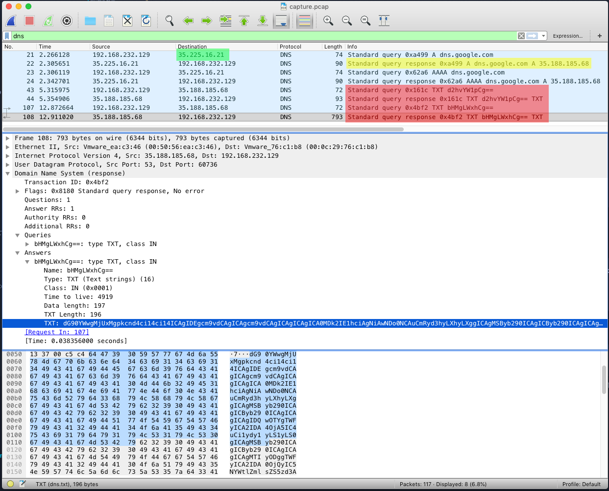
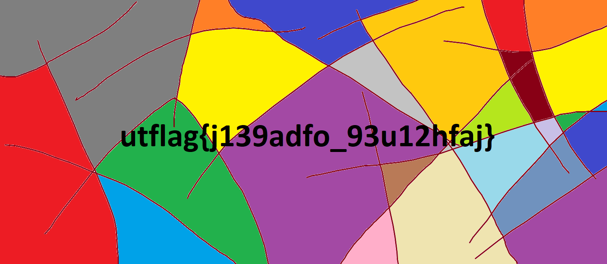
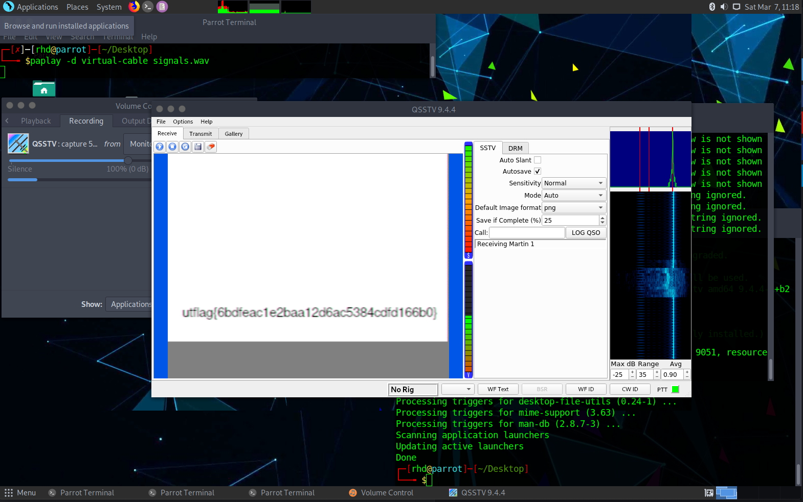
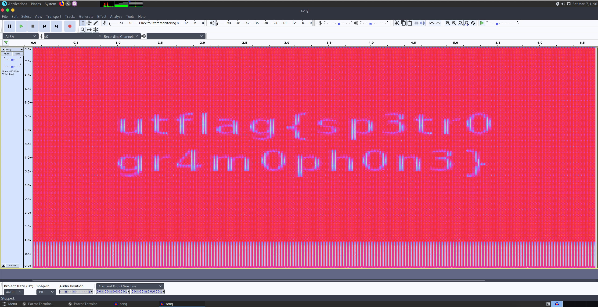

# UTCTF 2020

- [UTCTF 2020](#utctf-2020)
  - [Networking](#networking)
    - [Do Not Stop](#do-not-stop)
  - [Reverse Engineering](#reverse-engineering)
    - [PNG2](#png2)
  - [Forensics Challenges](#forensics-challenges)
    - [Observe Closely](#observe-closely)
    - [1 Frame per Minute](#1-frame-per-minute)
    - [[basics] forensics](#basics-forensics)
    - [Spectre](#spectre)
    - [The Legend of Hackerman, Pt. 1](#the-legend-of-hackerman-pt-1)
    - [The Legend of Hackerman, Pt. 2](#the-legend-of-hackerman-pt-2)

## Networking

### Do Not Stop
" One of my servers was compromised, but I can't figure it out. See if you can solve it for me!

by masond"

Provided capture.pcap

Pretty quickly noticed some weird DNS queries, highlighted in red:

Packets 21-24:
- Using DNS server 35.225.16.21 (highlighted in green)
- DNS query: dns.google.com
  - Returns: **35.188.185.65**

Is **35.188.185.65** actually dns.google.com or is 35.225.16.21 lying to us...

```
dig +short dns.google.com
8.8.8.8
8.8.4.4
```

Seems like it's lying.

Ok, let's see what 35.225.16.21 tells us dns.google.com is right now...

```
$ dig +short dns.google.com @35.225.16.21
3.88.57.227
$ dig +short -x 3.88.57.227
ec2-3-88-57-227.compute-1.amazonaws.com
```

Yeah, I don't think google uses AWS  for their dns... **3.88.57.227** likely in scope for the CTF. Let's check the weird traffic that was going to "dns.google.com" aka 3.88.57.227

Packets 43-44: DNS request to "dns.google.com" - 35.188.185.68 (during capture)
- DNS Request: d2hvYW1pCg==
  - b64 decoded: **whoami**
- DNS Response: cm9vdA==
  - b64 decoded: **root%**

Packets 107-108: DNS request to "dns.google.com"- 35.188.185.68 (during capture)
- DNS Request: bHMgLWxhCg==
  - b64 decoded: **ls -la**
- DNS Response: giant base64 string
  - b64 decoded: 
```
total 2512
drwxr-xr-x    1 root     root          4096 Mar  6 04:44 .
drwxr-xr-x    1 root     root          4096 Mar  6 08:09 ..
-rw-r--r--    1 root     root         12288 Mar  6 04:42 .Makefile.swp
-rw-r--r--    1 root     root           104 Mar  5 23:50 Dockerfile
-rw-r--r--    1 root     root           119 Mar  5 23:50 Makefile
-rw-r--r--    1 root     root            28 Mar  5 23:50 flag.txt
-rwxr-xr-x    1 root     root       2533823 Mar  6 04:44 server
-rw-r--r--    1 root     root          1693 Mar  5 23:50 server.go
```
Okay, seems like "dns.google.com" or 35.188.185.68 was been compromised, and was running a shell that is using the DNS protocol as cover to smuggle traffic.

Lets see if "dns.google.com" - now 35.88.57.227 is also compromised by sending commands to it over DNS.


```
$ dig +short $(echo -n "cat flag.txt" | base64) @3.88.57.227 | sed 's/"//g' | base64 --decode
utflag{$al1y_s3L1S_sE4_dN$}%
```

## Reverse Engineering

### PNG2

"In an effort to get rid of all of the bloat in the .png format, I'm proud to announce .PNG2! The first pixel is #7F7F7F, can you get the rest of the image?

by bnuno"

Provided pic.png2

```
$ hexdump -C pic.png2 | less
00000000  50 4e 47 32 77 69 64 74  68 3d 05 cf 68 65 69 67  |PNG2width=..heig|
00000010  68 74 3d 02 88 7f 7f 7f  7f 7f 7f 7f 7f 7f 7f 7f  |ht=.............|
00000020  7f 7f 7f 7f 7f 7f 7f 7f  7f 7f 7f 7f 7f 7f 7f 7f  |................|
*
000005c0  7f 7f 7f 7f 7f 7f 7f 7f  7f 7f d2 9f a7 88 00 15  |................|
000005d0  88 00 15 9f 30 41 ff 7f  27 ff 7f 27 ff 7f 27 ff  |....0A..'..'..'.|
000005e0  7f 27 ff 7f 27 ff 7f 27  ff 7f 27 ff 7f 27 ff 7f  |.'..'..'..'..'..|
000005f0  27 ff 7f 27 ff 7f 27 ff  7f 27 ff 7f 27 ff 7f 27  |'..'..'..'..'..'|
00000600  ff 7f 27 ff 7f 27 ff 7f  27 ff 7f 27 ff 7f 27 ff  |..'..'..'..'..'.|
00000610  7f 27 ff 7f 27 ff 7f 27  ff 7f 27 ff 7f 27 ff 7f  |.'..'..'..'..'..|
00000620  27 ff 7f 27 ff 7f 27 ff  7f 27 ff 7f 27 ff 7f 27  |'..'..'..'..'..'|
00000630  ff 7f 27 ff 7f 27 ff 7f  27 ff 7f 27 ff 7f 27 ff  |..'..'..'..'..'.|
00000640  7f 27 ff 7f 27 ff 7f 27  ff 7f 27 ff 7f 27 ff 7f  |.'..'..'..'..'..|
00000650  27 ff 7f 27 ff 7f 27 ff  7f 27 ff 7f 27 ff 7f 27  |'..'..'..'..'..'|
00000660  ff 7f 27 ff 7f 27 ff 7f  27 ff 7f 27 ff 7f 27 ff  |..'..'..'..'..'.|
00000670  7f 27 ff 7f 27 ff 7f 27  ff 7f 27 ff 7f 27 ff 7f  |.'..'..'..'..'..|
00000680  27 ff 7f 27 ff 7f 27 ff  7f 27 ff 7f 27 ff 7f 27  |'..'..'..'..'..'|
00000690  ff 7f 27 ff 7f 27 ff 7f  27 ff 7f 27 fb f7 f8 93  |..'..'..'..'....|
000006a0  18 2b 88 00 15 88 00 15  da af b6 3f 48 cc 3f 48  |.+.........?H.?H|
000006b0  cc 3f 48 cc 3f 48 cc 3f  48 cc 3f 48 cc 3f 48 cc  |.?H.?H.?H.?H.?H.|
000006c0  3f 48 cc 3f 48 cc 3f 48  cc 3f 48 cc 3f 48 cc 3f  |?H.?H.?H.?H.?H.?|
000006d0  48 cc 3f 48 cc 3f 48 cc  3f 48 cc 3f 48 cc 3f 48  |H.?H.?H.?H.?H.?H|
000006e0  cc 3f 48 cc 3f 48 cc 3f  48 cc 3f 48 cc 3f 48 cc  |.?H.?H.?H.?H.?H.|
[...]
002c1b40  a3 49 a4 a3 49 a4 a3 49  a4 a3 49 a4 a3 49 a4 a3  |.I..I..I..I..I..|
002c1b50  49 a4 a3 49 a4 a3 49 a4  a3 49 a4 a3 49 a4 a3 49  |I..I..I..I..I..I|
002c1b60  a4 a3 49 a4 a3 49 a4 a3  49 a4 a3 49 a4 a3 49 a4  |..I..I..I..I..I.|
002c1b70  a3 49 a4 a3 49 a4 a3 49  a4 a3 49 a4 a3 49 a4 a3  |.I..I..I..I..I..|
002c1b80  49 a4 a3 49 a4 a3 49 a4  a3 49 a4 a3 49 a4 a3 49  |I..I..I..I..I..I|
002c1b90  a4 a3 49 a4 a3 49 a4 a3  49 a4 a3 49 a4 a3 49 a4  |..I..I..I..I..I.|
002c1ba0  a3 49 a4 a3 49 a4 a3 49  a4 a3 49 a4 a3 49 a4 a3  |.I..I..I..I..I..|
002c1bb0  49 a4 a3 49 a4 a3 49 a4  a3 49 a4 a3 49 a4 a3 49  |I..I..I..I..I..I|
002c1bc0  a4 a3 49 a4 a3 49 a4 a3  49 a4 a3 49 a4 a3 49 a4  |..I..I..I..I..I.|
002c1bd0  a3 49 a4 a3 49 a4 a3 49  a4 a3 49 a4 a3 49 a4 a3  |.I..I..I..I..I..|
002c1be0  49 a4 a3 49 a4 a3 49 a4  a3 49 a4 a3 49 a4 a3 49  |I..I..I..I..I..I|
002c1bf0  a4 a3 49 a4 a3 49 a4 a3  49 a4 a3 49 a4           |..I..I..I..I.|
002c1bfd
```

Solution:

```python
from PIL import Image

input_filename = '/Users/rdubisky/Desktop/code/ctf/utctf/png2/pic.png2'

with open(input_filename, "rb") as f:
    data = f.read()
    hex_data = data.hex()

width = int.from_bytes(data[10:12], byteorder='big')
height = int.from_bytes(data[19:21], byteorder='big')
print(str(width) + ':' + str(height))

pixels = []
for i in range(21,len(data), 3):
    pixel = (data[i], data[i+1], data[i+2])
    pixels.append(pixel)

pixels.reverse() # Faster than pop(0)
img = Image.new('RGB', (width, height))
for y in range(0,height):
    for x in range(0,width):
        pixel = pixels.pop()
        # print('{},{}: {}'.format(x, y, pixel))
        img.putpixel((x,y), pixel)
img.show()
```




## Forensics Challenges

### Observe Closely

"A simple image with a couple of twists...
by phleisch"


Binwalk identified the magic bytes for a zip archive appended to the end of the expected PNG data.
```
$ binwalk Griffith_Observatory.png 

DECIMAL       HEXADECIMAL     DESCRIPTION
--------------------------------------------------------------------------------
0             0x0             PNG image, 320 x 155, 8-bit/color RGBA, non-interlaced
41            0x29            Zlib compressed data, default compression
**127759        0x1F30F         Zip archive data, at least v2.0 to extract, compressed size: 2587, uncompressed size: 16664, name: hidden_binary
130500        0x1FDC4         End of Zip archive
```
Use binwalk to extract all identified embedded files.
```
$ binwalk -e Griffith_Observatory.png
$ ls
Griffith_Observatory.png            _Griffith_Observatory.png.extracted
$ cd _Griffith_Observatory.png.extracted 
$ ls -lah
total 304
drwxr-xr-x  6 rdubisky  staff   192B Mar  8 18:47 .
drwxr-xr-x  5 rdubisky  staff   160B Mar  8 18:47 ..
-rw-r--r--  1 rdubisky  staff   2.7K Mar  8 18:47 1F30F.zip
-rw-r--r--  1 rdubisky  staff     0B Mar  8 18:47 29
-rw-r--r--  1 rdubisky  staff   127K Mar  8 18:47 29.zlib
-rwxr-xr-x  1 rdubisky  staff    16K Feb 27 17:10 hidden_binary
```

Run extracted **hidden_binary**
```
$ ./hidden_binary 
Ah, you found me!
utflag{2fbe9adc2ad89c71da48cabe90a121c0}
```

### 1 Frame per Minute

"I recently received this signal transmission known as SSTV in a mode called Martian? This technology is all very old so I'm not sure what to do with it. Could you help me out?

by phleisch"

We are provided signals.wav
SSTV is slow scan television. There are occasionally broadcasts in SSTV from the International Space Station that can be captured with consumer SDR equipment (Software defined radio)

SSTV can be decoded with **qsstv** on linux.

The following article was helpful for piping audio into qsstv:
https://ourcodeworld.com/articles/read/956/how-to-convert-decode-a-slow-scan-television-transmissions-sstv-audio-file-to-images-using-qsstv-in-ubuntu-18-04

Then, it's just a matter of running qsstv, and playing the wav file.



### [basics] forensics

"My friend said they hid a flag in this picture, but it's broken! Now that I think about it, I don't even know if it really is a picture...

by balex"

Provided secret.jpeg

```
$ file secret.jpeg
secret.jpeg: UTF-8 Unicode text, with CRLF line terminators

$ cat secret.jpeg | grep utflag
utflag{fil3_ext3nsi0ns_4r3nt_r34l}
```

### Spectre

"I found this audio file, but I don't think it's any song I've ever heard... Maybe there's something else inside?

by balex"

Provided song.wav

Open in audacity, view as spectrogram



### The Legend of Hackerman, Pt. 1

"My friend Hackerman tried to send me a secret transmission, but I think some of it got messed up in transit. Can you fix it?

by balex"

Provided hackerman.png

```
$ file hackerman.png 
hackerman.png: data

$ hexdump -C hackerman.png | less
00000000  00 00 00 00 0d 0a 1a 0a  00 00 00 0d 49 48 44 52  |............IHDR|
00000010  00 00 04 a8 00 00 02 9e  08 06 00 00 00 81 2e 23  |...............#|
00000020  af 00 00 28 25 7a 54 58  74 52 61 77 20 70 72 6f  |...(%zTXtRaw pro|
00000030  66 69 6c 65 20 74 79 70  65 20 65 78 69 66 00 00  |file type exif..|
00000040  78 da ad 9c 69 92 1c 37  92 85 ff e3 14 73 04 ec  |x...i..7.....s..|
```

If this is a png, it's missing its magic bytes. The first 4 bytes are 00000000 but are expected to be 89504E47. Substitute the correct magic bytes, and the file now opens correctly. I used hex fiend for this task.


For more information about magic bytes/file signatures check:
https://en.wikipedia.org/wiki/List_of_file_signatures

### The Legend of Hackerman, Pt. 2

"Ok, I've received another file from Hackerman, but it's just a Word Document? He said that he attached a picture of the flag, but I can't find it...

by balex"

Provided Hacker.docx

```
$ file Hacker.docx
Hacker.docx: Microsoft Word 2007+
```

Well, it appears to be a docx. Docx files are zips which contain multiple files used to describe the document.

```
$ unzip Hacker.docx
Archive:  Hacker.docx
  inflating: _rels/.rels             
  inflating: word/fontTable.xml      
  inflating: word/styles.xml         
  inflating: word/_rels/document.xml.rels  
  inflating: word/settings.xml       
  inflating: word/media/image97.png  
  inflating: word/media/image102.png  
[...]
  inflating: word/media/image169.jpeg  
  inflating: word/media/image37.png  
  inflating: word/numbering.xml      
  inflating: docProps/core.xml       
  inflating: docProps/app.xml        
  inflating: [Content_Types].xml     
  inflating: word/document.xml 
  ```

  185 image files in word/media

image23.png contains the flag


